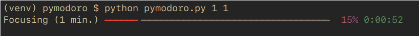

# Overview

A simple Pomodoro timer in Python.



# Usage

```
$ python pymodoro.py 25 5
```

# Setup

There is one dependency, [rich](https://pypi.org/project/rich/). To install use

```
pip install -r < ./requirements.txt
```
